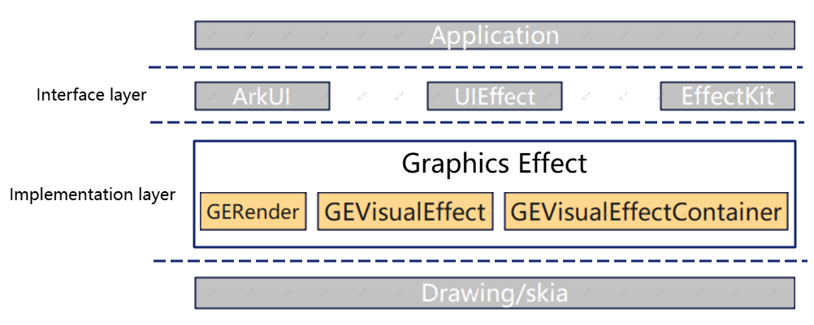

# graphics_effect

## Description

graphics_effect is an important component of OpenHarmony's graphics subsystem, providing visual effects algorithm capabilities including blur, distortion, color processing, lighting, SDF shapes and effects, masking, transition, and more.

## Software Architecture



> The architecture diagram shows a high-level overview; detailed layering is described below.

**Interface layer**: Graphics Effect opens its capabilities through ArkUI, UIEffect, and EffectKit.

**Implementation layer**: divided into the following six sub-modules:

| Sub-module | Capability description |
|------------|------------------------|
| Core | Effect definition and container (IGEFilterType, GEVisualEffect, GEVisualEffectContainer, GEEffectFactory) |
| Pipeline | Rendering pipeline and multi-pass composition (GERender, GEFilterComposer, various rendering passes, caching system) |
| Effect | Four effect subclass hierarchy (GEShaderFilter, GEShader, GEShaderMask, GEShaderShape) |
| HPS | High Performance Shader integration (HpsEffectFilter) |
| Ext | Dynamic loading extension (GEExternalDynamicLoader) |
| Util | Common utilities (GECommon, GEDowncast, GELog, GETrace, GESystemProperties, etc.) |

## Directory Structure

```
graphics_effect/
├── figures/              # Images referenced by Markdown
├── include/              # Public header files
│   ├── core/            # Core components (interfaces, base classes)
│   ├── effect/          # Effect implementations
│   │   ├── filter/      # Shader-based filters
│   │   ├── shader/      # Direct shader effects
│   │   ├── mask/        # Masking operations
│   │   └── shape/       # Shape effects (including SDF)
│   ├── effect_cfg/      # Effect configuration parsing
│   ├── ext/             # Extension functionality
│   ├── hps/             # HPS integration
│   ├── pipeline/        # Rendering pipeline and composition
│   └── util/            # Utility classes
├── src/                 # Implementation files (directory structure mirrors include)
│   └── util/
│       └── mock/        # Mock implementations for testing
└── test/
    ├── unittest/        # Unit tests
    ├── fuzztest/        # Fuzz tests
    └── tooltest/        # Tool tests
```

## Effect Type Hierarchy

The four effect subclass hierarchy is as follows:

```
IGEFilterType (base interface)
├── GEShaderFilter — Image processing filters (blur, distortion, color, lighting, SDF filters, transition, etc.)
├── GEShader — Direct shader effects (lighting animation, material, color, extension effects, etc.)
├── GEShaderMask — Masking operations (gradient masks, image masks, animated masks)
└── GEShaderShape — Shape effects (SDF shape definition and effect rendering)
```

## Usage

```cpp
// Using the following namespace conventions:
// using namespace OHOS::Rosen::Drawing;
// using namespace OHOS::GraphicsEffectEngine;
```

### ApplyImageEffect

```cpp
std::shared_ptr<Image> ApplyImageEffect(Canvas& canvas, GEVisualEffectContainer& veContainer,
    const ShaderFilterEffectContext& context, const SamplingOptions& sampling);
```

Example:

```cpp
Canvas canvas;
auto image = std::make_shared<Image>();
auto visualEffectContainer = std::make_shared<GEVisualEffectContainer>();
Rect src = { 0, 0, 100, 100 };
Rect dst = { 0, 0, 100, 100 };

auto geRender = std::make_shared<GERender>();
GERender::ShaderFilterEffectContext context = { image, src, dst, nullptr };
auto outImage = geRender->ApplyImageEffect(canvas, *visualEffectContainer, context, SamplingOptions());
```

### DrawShaderEffect

```cpp
void DrawShaderEffect(Canvas& canvas, GEVisualEffectContainer& veContainer, const Rect& bounds);
```

Used to draw shader effects (GEShader type) directly onto the canvas.

### ApplyHpsGEImageEffect

```cpp
ApplyHpsGEResult ApplyHpsGEImageEffect(Canvas& canvas, GEVisualEffectContainer& veContainer,
    const HpsGEImageEffectContext& context, std::shared_ptr<Image>& outImage, Brush& brush);
```

Used for HPS+GE mixed pipeline rendering with multi-pass composition strategies. The return value ApplyHpsGEResult contains hasDrawnOnCanvas (whether the result has been drawn directly on the canvas) and isHpsBlurApplied (whether HPS blur has been applied).

### DrawImageEffect

DrawImageEffect is a convenience wrapper over ApplyImageEffect that automatically draws the processed result onto the canvas after calling ApplyImageEffect. Users are recommended to use ApplyImageEffect or ApplyHpsGEImageEffect directly, to control the canvas.DrawImage / canvas.DrawImageRect process for advanced visual effects.

## Build and Test

> **Note**: All commands below must be run from the OpenHarmony root directory (the directory containing build.py), not from this repository root.

```bash
# Independent build (must run from OpenHarmony root directory)
hb build graphics_effect -i

# Product build (must run from OpenHarmony root directory)
./build.sh --product-name <product> --build-target graphics_effect

# Independent test build (must run from OpenHarmony root directory)
hb build graphics_effect -t

# Product test build (must run from OpenHarmony root directory)
./build.sh --product-name <product> --build-target graphics_effect_test
```

## Related Repositories

- [graphic_2d](../graphic_graphic_2d) — OpenHarmony 2D graphics rendering engine, providing Drawing API (Canvas, Image, etc.), which is the main dependency of this repository.
