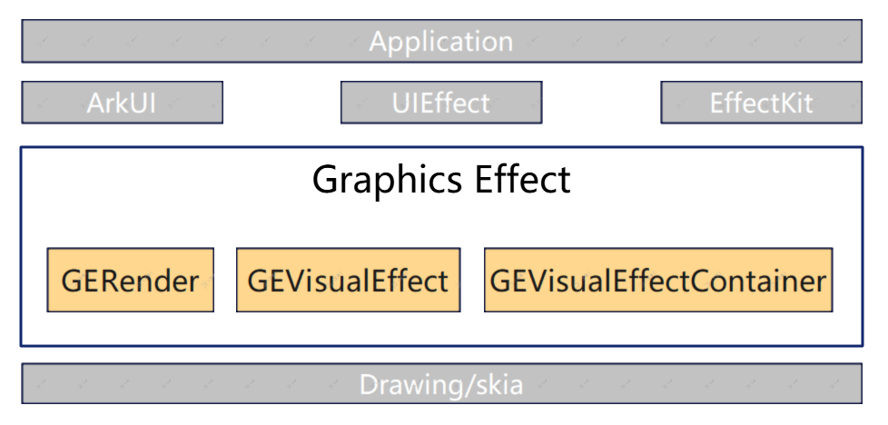

# graphics_effect

## 介绍

Graphics Effect是OpenHarmony图形子系统的重要部件，为图形子系统提供视觉特效算法能力，包括模糊、扭曲、颜色处理、光照、SDF形状与效果、遮罩、过渡等多种视觉特效。

## 软件架构



> 架构图展示的是高层概览，详细分层说明如下：

**接口层**: Graphics Effect通过ArkUI、UIEffect、EffectKit对外开放能力。

**实现层**: 分为以下六个子模块：

| 子模块 | 能力描述 |
|--------|----------|
| Core | 效果定义与容器（IGEFilterType、GEVisualEffect、GEVisualEffectContainer、GEEffectFactory） |
| Pipeline | 渲染管线与多Pass组合（GERender、GEFilterComposer、多种渲染PASS、缓存系统） |
| Effect | 四大效果子类体系（GEShaderFilter、GEShader、GEShaderMask、GEShaderShape） |
| HPS | 高性能着色器集成（HpsEffectFilter） |
| Ext | 动态加载扩展（GEExternalDynamicLoader） |
| Util | 公共工具（GECommon、GEDowncast、GELog、GETrace、GESystemProperties等） |

## 目录结构

```
graphics_effect/
├── figures/              # Markdown引用的图片
├── include/              # 公共头文件
│   ├── core/            # 核心组件（接口、基类）
│   ├── effect/          # 效果实现
│   │   ├── filter/      # 基于着色器的滤镜
│   │   ├── shader/      # 直接着色器效果
│   │   ├── mask/        # 遮罩操作
│   │   └── shape/       # 形状效果（含SDF）
│   ├── effect_cfg/      # 效果配置解析
│   ├── ext/             # 扩展功能
│   ├── hps/             # HPS集成
│   ├── pipeline/        # 渲染管线与组合
│   └── util/            # 工具类
├── src/                 # 实现文件（目录结构镜像include）
│   └── util/
│       └── mock/        # 测试Mock实现
└── test/
    ├── unittest/        # 单元测试
    ├── fuzztest/        # Fuzz测试
    └── tooltest/        # 工具测试
```

## 效果类型体系

四大效果子类层级如下：

```
IGEFilterType (基类接口)
├── GEShaderFilter — 图像处理滤镜（模糊、扭曲、颜色、光照、SDF滤镜、过渡等）
├── GEShader — 直接着色器效果（光照动画、材质、颜色、扩展效果等）
├── GEShaderMask — 遮罩操作（渐变遮罩、图像遮罩、动画遮罩）
└── GEShaderShape — 形状效果（SDF形状定义与效果渲染）
```

## 使用说明

```cpp
// 使用以下命名空间约定：
// using namespace OHOS::Rosen::Drawing;
// using namespace OHOS::GraphicsEffectEngine;
```

### ApplyImageEffect

```cpp
std::shared_ptr<Image> ApplyImageEffect(Canvas& canvas, GEVisualEffectContainer& veContainer,
    const ShaderFilterEffectContext& context, const SamplingOptions& sampling);
```

调用示例：

```cpp
Canvas canvas;
auto image = std::make_shared<Image>();
auto visualEffectContainer = std::make_shared<GEVisualEffectContainer>();
Rect src = { 0, 0, 100, 100 };
Rect dst = { 0, 0, 100, 100 };

auto geRender = std::make_shared<GERender>();
GERender::ShaderFilterEffectContext context = { image, src, dst, nullptr };
auto outImage = geRender->ApplyImageEffect(canvas, *visualEffectContainer, context, SamplingOptions());
```

### DrawShaderEffect

```cpp
void DrawShaderEffect(Canvas& canvas, GEVisualEffectContainer& veContainer, const Rect& bounds);
```

用于将着色器效果（GEShader类型）直接绘制到画布上。

### ApplyHpsGEImageEffect

```cpp
ApplyHpsGEResult ApplyHpsGEImageEffect(Canvas& canvas, GEVisualEffectContainer& veContainer,
    const HpsGEImageEffectContext& context, std::shared_ptr<Image>& outImage, Brush& brush);
```

用于HPS+GE混合管线渲染，支持多Pass组合策略。返回值ApplyHpsGEResult包含hasDrawnOnCanvas（是否已直接绘制到画布）和isHpsBlurApplied（是否已应用HPS模糊）。

### DrawImageEffect

DrawImageEffect是ApplyImageEffect的便捷封装，在调用ApplyImageEffect获取处理结果后自动将其绘制到画布上。建议用户优先使用ApplyImageEffect或ApplyHpsGEImageEffect，以便自行控制canvas.DrawImage / canvas.DrawImageRect的过程，满足高级视效需求。

## 构建与测试

> **注意**: 以下命令均需从OpenHarmony根目录（包含build.py的目录）执行，不可在本仓根目录执行。

```bash
# 独立构建（需从OpenHarmony根目录执行）
hb build graphics_effect -i

# 产品构建（需从OpenHarmony根目录执行）
./build.sh --product-name <product> --build-target graphics_effect

# 独立测试构建（需从OpenHarmony根目录执行）
hb build graphics_effect -t

# 产品测试构建（需从OpenHarmony根目录执行）
./build.sh --product-name <product> --build-target graphics_effect_test
```

## 相关仓库

- [graphic_2d](../graphic_graphic_2d) — OpenHarmony 2D图形渲染引擎，提供Drawing API（Canvas、Image等），是本仓的主要依赖来源。
